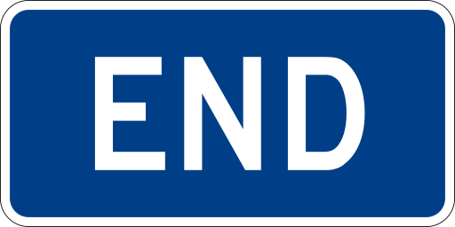

# Creando nuestra propia clase

A continuación aprenderemos cómo crear nuestra propia clase en [https://schools.duolingo.com/](https://schools.duolingo.com/). De esta manera podremos asignar tareas a nuestros alumnos, llevar un seguimiento de su cumplimiento y ver un registro de su actividad. ¡Recuerda! Tus alumnos deben saber que, al ser miembros de tu clase podrás ver sus direcciones de correo y cambiarles la contraseña de acceso a Duolingo.

<iframe width="100%" height="569" src="https://docs.google.com/presentation/d/1dkmZuInxbhyNDXvn3zqOklZ47hqG09c4fn9p9THY79I/embed?start=false&amp;loop=false&amp;delayms=3000"></iframe>

## ¡Ahora sólo queda ponerlo en práctica!

Espero que este curso te haya resultado útil y puedas poner en práctica lo aprendido. Hoy no he llegado a mi meta diaria ¡Me voy a practicar un rato! 

